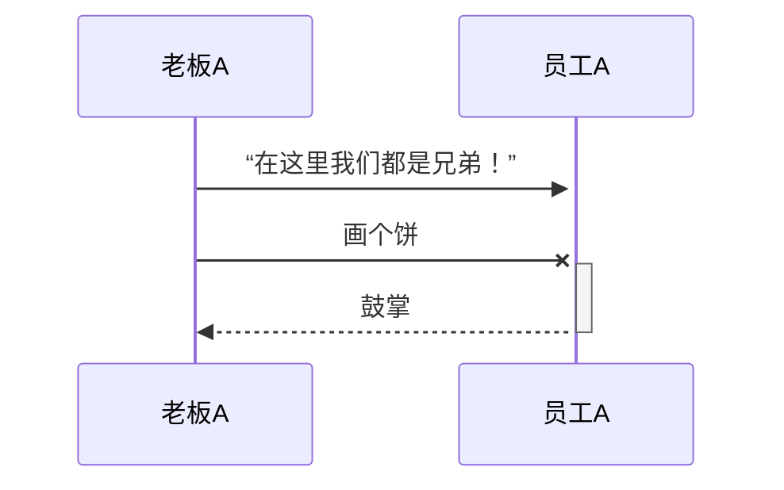
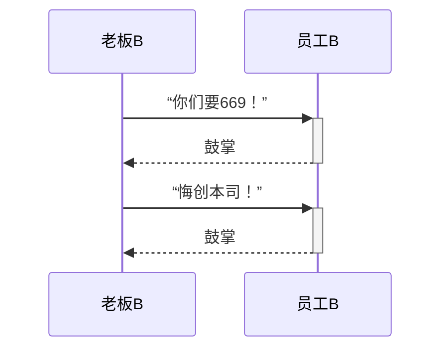
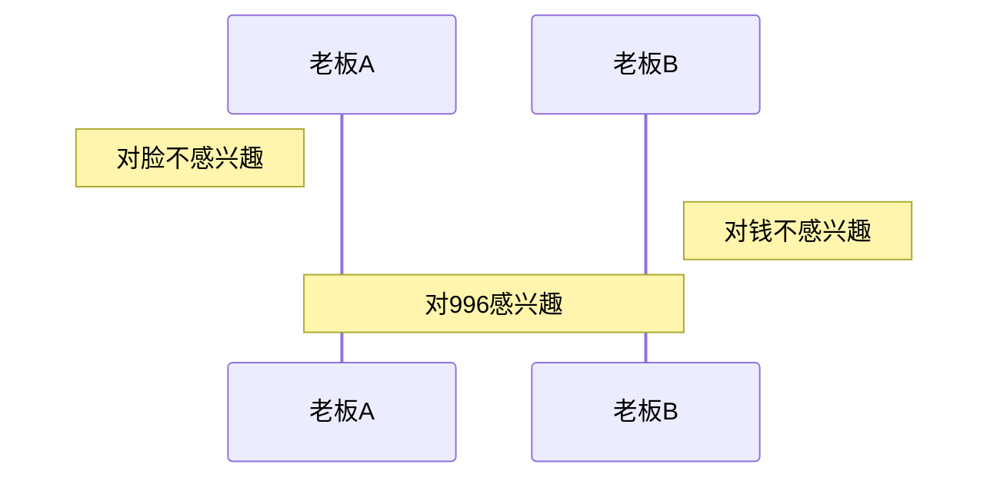
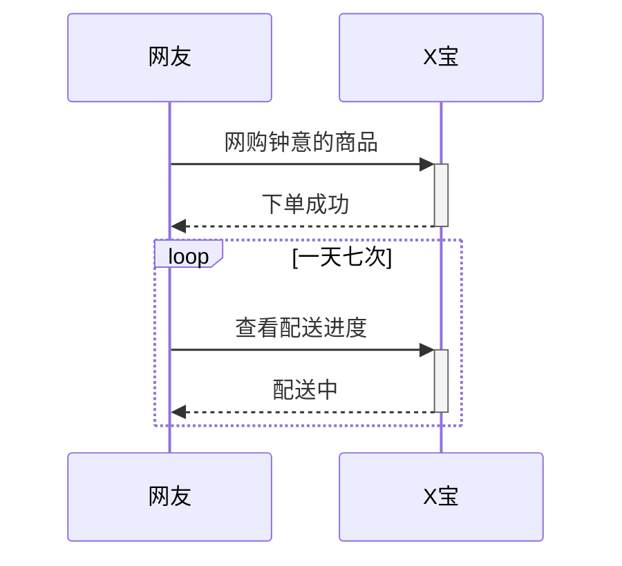
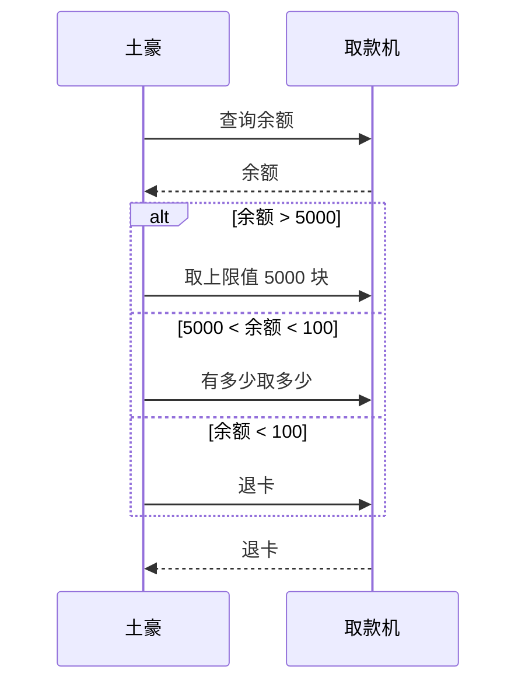
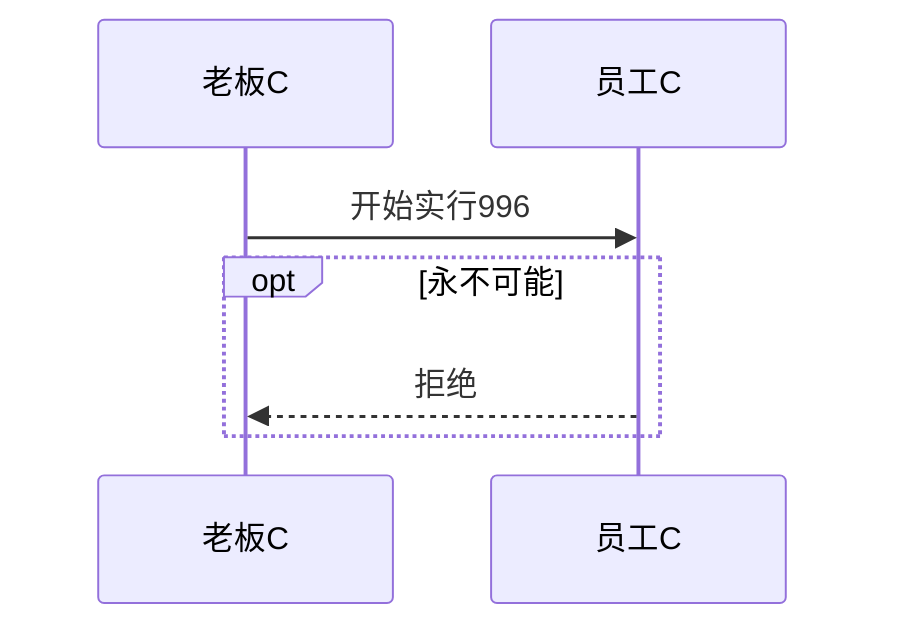
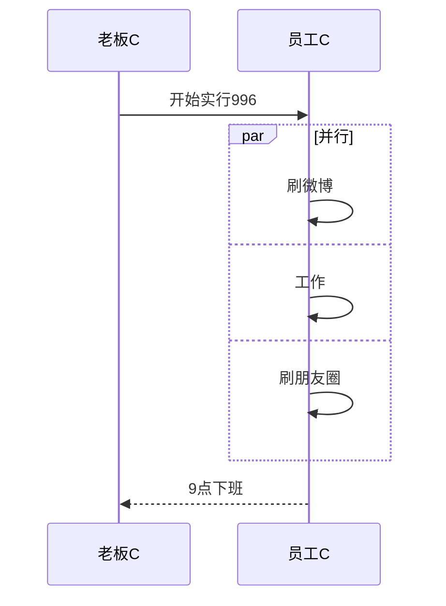
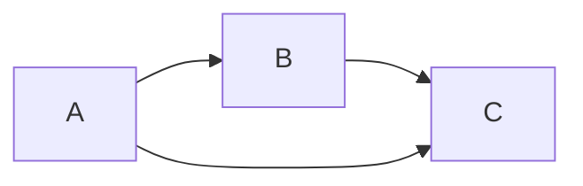

>消息语句格式为：<参与者> <箭头> <参与者> : <描述文本>。
>其中 <箭头>的写法有：
> ->> 显示为实线箭头（主动发出消息）
> -->>显示为虚线箭头（响应）
> -x显示为末尾带「X」的实线箭头（异步消息）














[链接文字](http://www.kancloud.cn)

看云是一个文档写作[^write]和托管平台[^platform]。
[^write]: 写作格式采用Markdown格式，支持版本和多人写作。

[^platform]: 发布的文档可以直接在平台阅读、分享和私有存储，并支持付费阅读。

单行代码 `define('APP_DEBUG',      false);`


多行代码：
```
// 系统常量定义
defined('THINK_PATH')   or define('THINK_PATH',     __DIR__.'/');
defined('APP_PATH')     or define('APP_PATH',       dirname($_SERVER['SCRIPT_FILENAME']).'/');
defined('APP_STATUS')   or define('APP_STATUS',     ''); // 应用状态 加载对应的配置文件
defined('APP_DEBUG')    or define('APP_DEBUG',      false); // 是否调试模式
```

> 这是一段引用内容文字  
> 这是第二行引用内容文字  
> 这是第三行引用内容文字 

>[info] 这里是**提示信息**
>通常用于一些提醒事项

>[warning] 这里是**警告信息**
>通常用于一些警告事项

>[danger] 这里是**危险信息**
>需要引起特别的注意

| 编号 | 产品 | 描述 |
|---|---|---|
| 1 | ThinkPHP  | 开源WEB应用框架  | 
| 2 | OneThink  | 开源内容管理框架   | 
| 3 | 看云  | 文档托管平台   |


